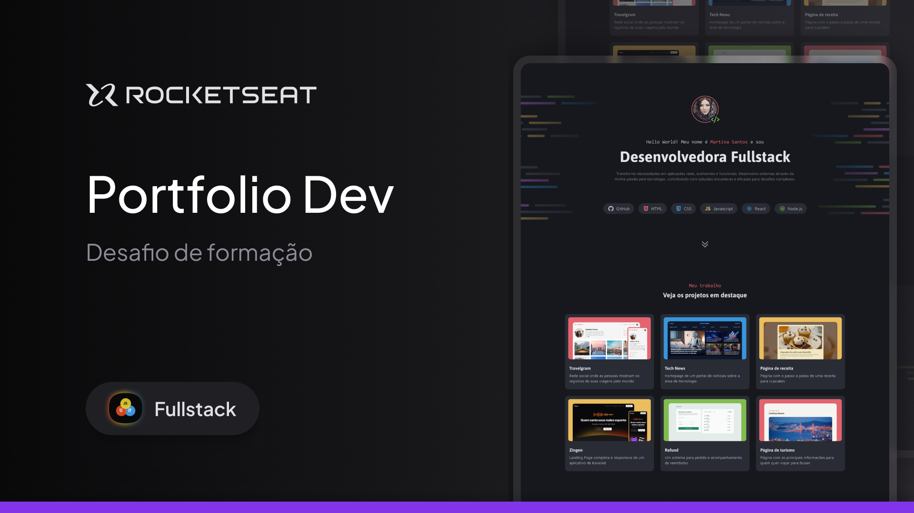

<h1 align="center"> Portfolio Dev </h1>

Projeto exclusivo, promovido pela Rocketseat para ensino de tecnologias WEB.

 

  

## 🚀 Tecnologias

Esse projeto foi desenvolvido com as seguintes tecnologias:

- HTML e CSS
- Figma
- Git e Github

## 💻 Projeto

O Porfolio Dev é um projeto fictício para usar como um Porfolio Web dos projetos e servicos do Dev.

## 🔖 Layout

Você pode visualizar o layout do projeto através [DESSE LINK](https://www.figma.com/design/UxoC04OZqaIoskP0AvADMs/Portfolio-Dev-(Community)?node-id=915-685&node-type=frame&t=yJ46dik5BKoKyvEr-0). É necessário ter conta no [Figma](https://figma.com) para acessá-lo.

## :memo: Licença

Esse projeto está sob a licença MIT.

---

Feito com ♥ by Rocketseat :wave: [Participe da nossa comunidade!](https://discord.gg/rocketseat)